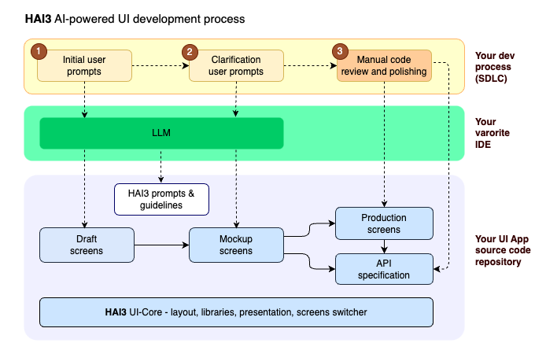

# HAI3 — AI-Optimized UI Development Kit for Modern SaaS Applications

**HAI3** is a **UI development kit** for modern SaaS applications — heavily optimized for **AI-driven UI generation** with minimal human assistance.
It provides a structured, multi-layered framework that enables **AI systems and humans to collaborate** on building, evolving, and refining user interfaces — from drafts and mockups to production-ready screens.

---

## Overview

The HAI3 Dev Kit introduces a new paradigm in UI development where product management and designers can work with AI to create and polish user interfaces and engineers can take the generated code and turn it into production-ready code.

With HAI3, UI development becomes a **three-layer process** where AI and humans co-create interfaces:
- AI generates **draft** layouts using standardized prompts and patterns.
- Designers and PMs refine **mockups** with lightweight iteration over drafts.
- Engineers finalize **production screens** with reusable components taking the mockups as a starting point.

HAI3 provides the visual structure (menu, header, footer, sidebars, main view), defines source code layout conventions, microfrontend engine, customizable type system, and a screen-set switcher ensuring that generated screens reuse needed components libraries and visual styles. It also provides a structured prompting system and AI generation guide set that enables consistent, parameterized UI generation via LLMs.

This approach enables **multi-repository**, **multi-persona**, and **AI-assisted** workflows — making it ideal for SaaS ecosystems that require rapid iteration, consistent design language, and integration with automated generation tools.

---

## Core Architecture

HAI3 is structured around **three main projections**, each addressing a critical dimension of the development lifecycle.

### Projection #I - Assets

| Asset | Description |
|--------|--------------|
| **1. UI Core** | The foundational layer providing the visual structure (menu, header, footer, sidebars, main view). Defines source layout conventions, microfrontend engine, customizable type system, and a screen-set switcher. |
| **2. Prompts & Guidelines** | A structured prompting system and AI generation guide set that enables consistent, parameterized UI generation via LLMs. |
| **3. Build System** | Flexible build pipeline that can produce Web apps or Electron apps, configure included screen-sets, and pull screens from multiple repositories, and also build the mock API servers automatically. |

Each HAI3 project includes these three assets to ensure **repeatable, automatable, and composable** UI generation workflows.

---

### Projection #II - Screen-Set Categories

The UI Core is built to host **three categories of screen-sets**, corresponding to the evolution stages of an interface.

| Category | Purpose | Description |
|-----------|----------|-------------|
| **1. Drafts** | AI-generated layouts | Automatically created by AI agents using HAI3 prompt sets, rules and conventions. Multiple draft sets can coexist (e.g., per PM or feature group). |
| **2. Mockups** | Semi-refined screens | Converted from drafts when human designers or PMs start refining visual and interaction details. |
| **3. Production Screens** | Finalized versions | Human-polished mockups integrated into production builds. |

Each category lives in its own folder and is accessible via the **screen-set switcher** — allowing instant preview or live toggling across versions directly in the UI.

---

### Projection #III - UI Core Layers

HAI3’s **UI Core** consists of three architectural layers designed for composability and reuse.

| Layer | Description |
|--------|-------------|
| **1. Presentation Layer** | Component library including buttons, grids, menus, modals, typography, and TailwindCSS-based style sets. |
| **2. Layout Layer** | Defines the visual structure — menu, header, footer, right sidebar, popup window system, and screen containers. |
| **3. Libraries Layer** | Includes shared utilities: HTTP store, event system, plugin host, and microfrontend integration engine. |

The combination of these layers allows developers to **compose UI experiences** from modular parts, shared repos, and AI-generated code.

---

## AI + Human Collaboration Model

HAI3 defines a **three-stage development workflow**



- **Drafts**: AI-generated layouts
- **Mockups**: Semi-refined screens
- **Production Screens**: Finalized versions

TODO - to describe the workflow in details

## Technology

- [React](https://react.dev/)
- [Tailwind CSS](https://tailwindcss.com/)
- [TypeScript](https://www.typescriptlang.org/)
- [Webpack](https://webpack.js.org/)
- [Electron](https://www.electronjs.org/)
- [Shadcn UI](https://ui.shadcn.com/)

### Dependencies

- [Node.js](https://nodejs.org/) v20.11.0+

### Build

```bash
npm install
npm build
npm start -- starts the web version
```

Building an Electron app:

```bash
npm run build:electron
npm run electron
```

# Writing a UI project using the HAI3 Dev Kit

TODO - project layout, microfrontend concepts, GTS references, bulding a project, samples link

## License

HAI3 is available under the [Apache License 2.0](LICENSE).
